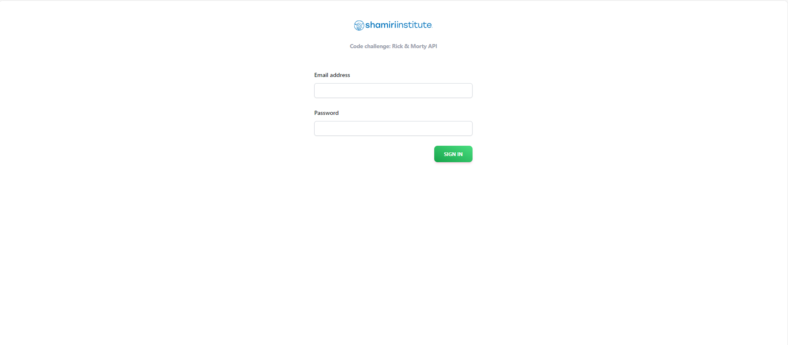
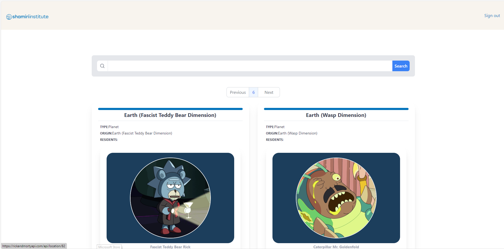
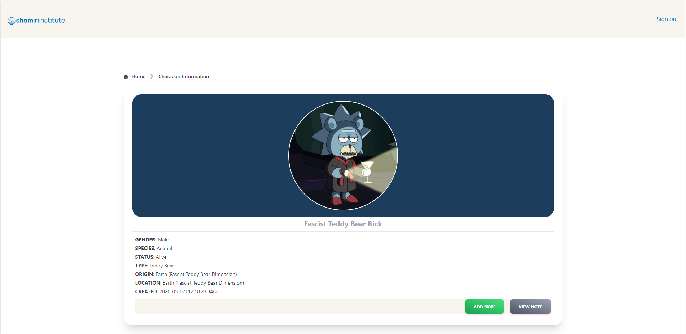
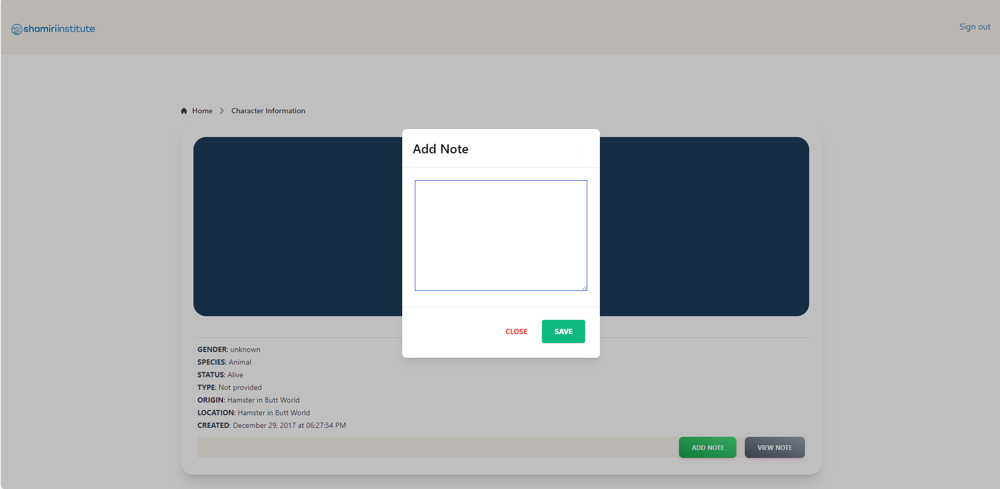

# planet-shamiri

A simple web platform that incorporates Ricky &amp; Monty API.

The following features have been implements:

1. A Login page to control access to web application.
2. Retrieves & displays location's {name, type} including resident's  {name, status, image etc.}.
3. A search bar to run a filter based on either {name, type, dimention etc.}. The search operation does not cover episodes or individual character filter.
4. Provide detailed resident's view with extra information about a character on a single page which also includes the ability to create a new note & view note(s).
5. Storage of notes on localStorage.

## Design

The design considerations incoporated in this assigment includes:

1. __Component-based Architecture__ 

    I have broken down UI into resusable components with a single responsibility.

2. __Responsive Design__ 

    The application is responsive accross different devices & screen sizes. I have utilised Tailwind CSS responsive utility classes to adapt to different UI.

3. __Performance Optimization__

    I have adopted optimization technique such as lazy loading to reducing rendering time.

4. __Routing__

    Implemented routing using React Router which defines routes for different views & handle navigation within the application.

5. __Error handling__

    I have implemented mechanism to handle errors and prevent the application from crashing.

6. __Scalability and Maintainability__

    The codebase is organised in a modular fashion & contained in different directores which will facilitate future development & enhancement. The directories are structured as follows:

    - components
    - layout
    - pages
    - session
    - localStorage
    - css

### Database

I opted to persist a note against a character on localStorage which is informed by the following:

- No access to a remote database.
- Data is persisted on localStorage even after the browser is closed.
- Provides an offline support to cache data.

Overall, localStorage is a versatile client-side storage mechanism that improves performance & user experience that enables offline functionality and state management.

### Credentials

Email: __admin@admin.com__
Password: __admin__

## Screenshot

**Login Page**

**Home Page**

**Character Detail Page**

**Add Note Modal**

## Resources

1. Ricky Monty's API documentation

https://rickandmortyapi.com/

2. React

https://react.dev/reference/react

3. Tailwindcss

https://tailwindcss.com/